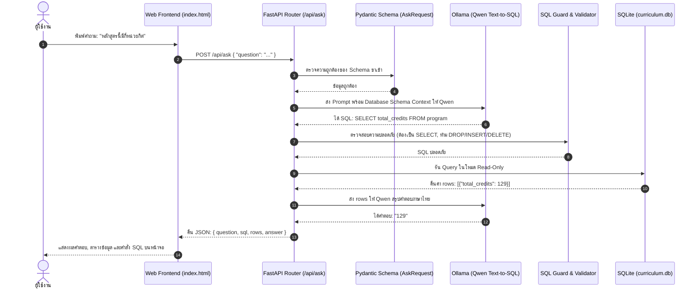

# รายงานสรุป Lab 10: การพัฒนา RESTful API ด้วย FastAPI สำหรับเว็บถามตอบหลักสูตร (Curriculum Q&A Application)

---

## 1. ภาพรวมของโปรเจกต์ (Executive Summary)

ในแลปก่อนหน้า (Lab 7B ถึง Lab 9) ระบบได้ทำการสกัดข้อมูลจากเล่มหลักสูตรผ่าน OCR/LLM และนำเข้าสู่ฐานข้อมูล SQLite (`curriculum.db`) รวมทั้งมีการทดสอบแปลงคำถามเป็น SQL (Text-to-SQL) ผ่าน CLI และคำนวณวัดผลความถูกต้องเรียบร้อยแล้ว

**Lab 10** นี้เป็นการต่อยอดตามเอกสารบรรยาย **`ch10_API.pdf`** และชุดโค้ดใน **`lab10_fastapi`** โดยมีเป้าหมายคือ:
> **"ยกระดับการทำงานจากระบบสคริปต์เดี่ยว (CLI) สู่การเป็น Web Application เต็มรูปแบบ ด้วยสถาปัตยกรรม RESTful API ผ่าน FastAPI"**

ระบบทำหน้าที่เป็นตัวกลางเชื่อมระหว่าง **Web Frontend (หน้าเว็บที่ผู้ใช้เห็น)** กับ **AI Model (Ollama / Qwen)** และ **Database (SQLite)** เพื่อให้ผู้ใช้งานสามารถเปิดหน้าเว็บพิมพ์คำถามภาษาไทย ค้นหารายวิชา และตรวจสอบข้อมูลหลักสูตรได้อย่างสะดวก ปลอดภัย และมีมาตรฐาน

---

## 2. สรุปเนื้อหาสำคัญจากเอกสารบรรยาย (`ch10_API.pdf`)

เอกสารบรรยายได้ปูพื้นฐานการออกแบบและสร้างระบบ Web API สำหรับงานปัญญาประดิษฐ์และฐานข้อมูล โดยมีประเด็นสำคัญดังนี้:

### 2.1 สถาปัตยกรรม 4 เลเยอร์ (Architecture Overview)
```text
[ ผู้ใช้งาน / Browser ] 
        │ (HTTP Request / Response)
        ▼
[ Frontend Layer ] : index.html, CSS, JavaScript (Fetch API)
        │ 
        ▼
[ API Gateway Layer ] : FastAPI (Routing, Validation, Serialization)
        │
        ├───────────────────────────────┐
        ▼                               ▼
[ AI Model Service ]           [ Database Adapter ]
  Ollama + Qwen (Text-to-SQL)     SQLite (curriculum.db)
```

### 2.2 การออกแบบ RESTful API และ CRUD Mapping
การกำหนด Endpoint และ HTTP Methods ให้ตรงกับมาตรฐานสากล:
- **POST** (Create / INSERT): ใช้สร้างหรือเพิ่มข้อมูล เช่น `POST /api/courses`
- **GET** (Read / SELECT): ใช้อ่านหรือค้นหาข้อมูล เช่น `GET /api/courses?search=...`, `GET /api/program`
- **PUT / PATCH** (Update / UPDATE): ใช้แก้ไขข้อมูล
- **DELETE** (Delete / DELETE): ใช้ลบข้อมูล

### 2.3 การจัดการ Query Parameters (Filtering & Sorting)
- การคัดกรองข้อมูล (Filter): เช่น `?search=06026240` หรือ `?year=1&semester=1`
- การแบ่งหน้า (Pagination): ใช้ `limit` และ `offset` เพื่อไม่ให้ฐานข้อมูลทำงานหนักเกินไป

### 2.4 HTTP Status Codes & Error Handling
เซิร์ฟเวอร์ต้องส่งสถานะกลับไปให้ชัดเจน เพื่อให้ Frontend สามารถจัดการแสดงผลข้อความแจ้งเตือนแก่ผู้ใช้ได้อย่างถูกต้อง:
- `200 OK`: การร้องขอสำเร็จ คืนข้อมูลตามปกติ
- `201 Created`: เพิ่มข้อมูลรายวิชาใหม่สำเร็จ
- `400 Bad Request`: คำขอผิดพลาด ไม่ตรงตามเงื่อนไข
- `404 Not Found`: ไม่พบข้อมูล เช่น ไม่พบข้อมูลหลักสูตร
- `409 Conflict`: เกิดข้อมูลขัดแย้ง เช่น รหัสวิชาซ้ำกับที่มีอยู่ในฐานข้อมูล
- `422 Unprocessable Entity`: โมเดลสร้างคำสั่ง SQL ผิดพลาด หรือ Request body ไม่ตรงตาม Schema
- `503 Service Unavailable`: ระบบยังไม่พร้อม เช่น ไฟล์ฐานข้อมูลไม่อยู่ หรือติดต่อ Ollama ไม่ได้

### 2.5 Security Best Practices
- **แยกค่า Config ออกจากโค้ด**: เก็บ URL, Path ฐานข้อมูล, ชื่อโมเดล ไว้ในไฟล์ `.env` และเพิ่ม `.env` ลงใน `.gitignore` เสมอ
- **Data Validation**: ใช้ Pydantic ป้องกันข้อมูลผิดรูปแบบตั้งแต่ด่านแรก
- **SQL Injection Prevention / Safety Guard**: รันคำสั่ง SQL ในโหมด Read-Only และมี Guard กรองให้เฉพาะคำสั่ง `SELECT` เท่านั้น ไม่อนุญาตคำสั่ง `DROP`, `DELETE`, `UPDATE` เด็ดขาด

---

## 3. โครงสร้างไฟล์ในระบบ (`lab10_fastapi/curriculum_app`)

```text
isd-2026-OCR-LLM-QNA_main/
├── lab10_fastapi/
│   └── curriculum_app/
│       ├── .env.example          # ตัวอย่างไฟล์ Environment Variables
│       ├── .env                  # ไฟล์ Config ประจำเครื่อง (ห้ามนำขึ้น Git)
│       ├── config.py             # โหลดค่าจาก .env เข้า Dataclass Settings
│       ├── schemas.py            # Pydantic Schemas กำหนด Data Contract
│       ├── database.py           # ตัวเชื่อมต่อ SQLite และควบคุมความปลอดภัย SQL
│       ├── model_service.py      # ตัวประสานงาน Text-to-SQL กับ Ollama (Qwen)
│       ├── main.py               # จุดศูนย์กลาง FastAPI Router และ Web Server
│       ├── requirements.txt      # รายการแพ็กเกจ Python สำหรับแอป
│       └── static/
│           └── index.html        # หน้าเว็บ Frontend สำหรับผู้ใช้
├── src/
│   └── ocr_system/
│       └── lab8b_curriculum_db.py # โมดูลหลักสูตรและฟังก์ชัน SQL Guard จาก Lab 8B
└── work/
    └── lab8b_run/
        └── curriculum.db         # ไฟล์ฐานข้อมูล SQLite ที่สกัดได้จากเล่มหลักสูตร
```

### หน้าที่ของแต่ละโมดูล:
1. **`main.py`**: ประกาศแอปพลิเคชัน FastAPI, Mount หน้า static web, กำหนด endpoints ทั้งหมด และจัดการ Error Handling ผ่าน `HTTPException`
2. **`schemas.py`**: กำหนดโครงสร้างข้อมูลด้วย Pydantic เช่น:
   - `AskRequest`: รับเฉพาะข้อความ `question` (ความยาว 2-500 ตัวอักษร)
   - `AskResponse`: ส่งกลับ `question`, `sql`, `rows`, `answer`
   - `CourseCreate`: กำหนดกฎรหัสวิชาต้องเป็นตัวเลข 8 หลัก (`^\d{8}$`), จำนวนหน่วยกิต 0-12
   - `HealthResponse`: รายงานสถานะความพร้อมของ DB และ Ollama
   - `CoursePrerequisitesResponse` และ `PrerequisiteItem`: กำหนด Data Contract สำหรับส่งข้อมูลวิชาบังคับก่อน (`prerequisites_required`) และวิชาที่ปลดล็อคให้เรียนต่อ (`unlocked_courses`)
3. **`database.py`**: คลาส `CurriculumDatabase` ที่นำฟังก์ชัน `open_db()` และ `guard_sql()` จาก Lab 8B มาใช้งาน เปิดฐานข้อมูลแบบ Read-only เสมอ และเพิ่มเมธอด `get_course_prerequisites()` สำหรับ Query ข้อมูลวิชาบังคับก่อนอย่างปลอดภัย
4. **`model_service.py`**: คลาส `QwenTextToSQL` จัดการ System Prompt, การแปลงภาษาไทยเป็น SQL คำสั่งเดียว และการนำผลลัพธ์จากฐานข้อมูลมาให้โมเดลสรุปเป็นข้อความภาษาไทย
5. **`static/index.html`**: หน้าเว็บแบบ Single Page ใช้งานง่าย สะอาดตา ประกอบด้วยส่วนถามคำถาม AI (Text-to-SQL) และส่วนตรวจสอบวิชาบังคับก่อน (พร้อมระบบ Autocomplete ค้นหารายชื่อวิชา และปุ่มลัดคลิกทดสอบวิชาตัวอย่าง)

---

## 4. รายการ API Endpoints ทั้งหมดในระบบ

### 4.1 Endpoints มาตรฐานของแลป
| Method | Endpoint | หน้าที่ | Parameters / Body | Status Code ที่ตอบกลับ |
|---|---|---|---|---|
| **GET** | `/` | เปิดหน้าเว็บ UI | ไม่มี | 200 (HTML File) |
| **GET** | `/api/health` | ตรวจสอบสุขภาพระบบ | ไม่มี | 200 OK (สถานะ `ok` หรือ `degraded`) |
| **GET** | `/api/program` | ดึงข้อมูลภาพรวมหลักสูตร | ไม่มี | 200 OK / 404 / 503 |
| **GET** | `/api/courses` | ค้นหาและดูรายการวิชา | Query: `search`, `limit`, `offset` | 200 OK / 503 |
| **POST** | `/api/courses` | เพิ่มรายวิชาใหม่เข้า DB | JSON: `CourseCreate` | 201 Created / 409 Conflict / 503 |
| **POST** | `/api/ask` | ถามคำถามหลักสูตรด้วย AI | JSON: `{"question": "..."}` | 200 OK / 422 / 503 |

### 4.2 Endpoint เพิ่มเติมที่เป็นเอกลักษณ์เฉพาะบุคคล (Individual API Contribution)
เพื่อสร้างจุดเด่นเฉพาะตัวที่ไม่ซ้ำกับเพื่อนในกลุ่ม ได้พัฒนา API เพิ่มเติม 1 เส้นทางตามหลัก RESTful และความต้องการจริงของนักศึกษา:

| Method | Endpoint | หน้าที่ & ฟีเจอร์เด่น | Parameters / Body | Status Code |
|---|---|---|---|---|
| **GET** | `/api/courses/{code}/prerequisites` | **Prerequisite Dependency Analyzer**: ตรวจสอบสายวิชาบังคับก่อน โดยแสดงทั้งวิชาที่ต้องผ่านมาก่อน (Requires) และวิชาที่จะปลดล็อคให้ลงเรียนต่อได้ (Unlocks) เชื่อมโยงกับตาราง `prerequisite` จาก Lab 8B | Path Parameter: `code` (รหัสวิชา 8 หลัก) | 200 OK / 404 Not Found / 422 / 503 |

#### 4.2.1 เหตุผลและความสำคัญในการออกแบบ API นี้
1. **แก้ปัญหาข้อจำกัดของ LLM (Zero Hallucination)**: การถามคำถามเรื่องวิชาบังคับก่อนผ่าน AI ทั่วไป (เช่น "วิชา 06016407 ต้องเรียนอะไรมาก่อน") โมเดลภาษาอาจเผลอสร้างคำสั่ง SQL ที่มีช่องว่างคั่นตัวเลข เช่น `WHERE code = '0601640 7'` หรือจำสับสนระหว่างวิชาบังคับก่อน (Requires) กับวิชาที่ปลดล็อค (Unlocks) การสร้าง Dedicated REST API ที่ใช้ Parameterized SQL และ Regex Validation จึงการันตีความถูกต้อง 100%
2. **ตอบโจทย์การวางแผนการศึกษาจริง**: นักศึกษาจำเป็นต้องรู้ทั้ง **"วิชาที่ต้องเรียนผ่านก่อน"** เพื่อไม่ให้ลงทะเบียนผิดพลาด และ **"วิชาที่จะปลดล็อคให้เรียนต่อ"** เพื่อวางแผนระยะยาวว่าหากตกวิชานี้จะติดสถานะ Prerequisite ในวิชาใดต่อไปบ้าง
3. **ต่อยอดข้อมูลจาก Lab 8B**: ดึงศักยภาพของตาราง `prerequisite` ที่สกัดได้จากเล่มหลักสูตรมาสร้างคุณค่าบน Web Application อย่างเป็นรูปธรรม

#### 4.2.2 การทำงานเชิงเทคนิคเบื้องหลัง (Technical Implementation)
1. **Data Validation (`schemas.py`)**:
   - กำหนด Pydantic Model `CoursePrerequisitesResponse` และ `PrerequisiteItem`
   - ตรวจสอบรหัสวิชาด้วย Regex `^\d{8}$` หากไม่เป็นตัวเลข 8 หลัก เซิร์ฟเวอร์จะตัดการทำงานทันทีและตอบกลับ `422 Unprocessable Entity`
2. **Database Querying (`database.py`)**:
   - เปิดการเชื่อมต่อ SQLite แบบ Read-Only (`mode=ro`)
   - **Step 1**: ค้นหารายวิชาในตาราง `course` หากไม่พบจะคืนค่า `404 Not Found`
   - **Step 2 (Requires)**: Query ตาราง `prerequisite WHERE code = ?` พร้อม `LEFT JOIN course` เพื่อดึงชื่อวิชาและหน่วยกิตของวิชาที่ต้องผ่านก่อน
   - **Step 3 (Unlocks)**: Query ตาราง `prerequisite WHERE requires = ?` พร้อม `LEFT JOIN course` เพื่อดึงรายชื่อวิชาที่จะปลดล็อคให้ลงเรียนได้
3. **Frontend Integration (`static/index.html`)**:
   - เพิ่มระบบ **Autocomplete (Datalist)** เชื่อมโยงกับ `/api/courses?limit=100` ให้ผู้ใช้พิมพ์เลือกรหัสวิชาจากฐานข้อมูลได้ทันที
   - เพิ่มปุ่มลัดคลิกทดสอบวิชาตัวอย่าง (Sample Chips) ทั้งวิชาที่มี Prerequisite (`06016407`, `06016418`), วิชาที่ปลดล็อควิชาอื่น (`06016406`), และวิชาที่ไม่มี Prerequisite (`06016401`)

#### 4.2.3 การวิเคราะห์ขอบเขตฐานข้อมูล (ทำไมบางวิชาเจอ บางวิชาไม่เจอ)
* **ฐานข้อมูลปัจจุบัน**: อ้างอิงจาก `work/lab8b_run/curriculum.db` ซึ่งเป็นข้อมูลของ **หลักสูตร IT (เทคโนโลยีสารสนเทศ) แผนปกติ** มีจำนวนรายวิชาทั้งหมด **41 รายวิชา** ตามแผนการศึกษา 4 ปี
* **วิชาที่ค้นหาเจอ**: รายวิชาที่อยู่ใน 41 วิชานี้ของหลักสูตร IT
* **วิชาที่ค้นหาไม่เจอ (ขึ้น 404)**: หากนำรหัสวิชาของสาขาอื่นมาค้นหา เช่น DSBA (รหัสขึ้นต้น `0602xxxx`) หรือ BIT (รหัสขึ้นต้น `0603xxxx`) หรือวิชาเลือกเสรีที่ไม่ได้ระบุรหัสในแผน จะไม่พบในฐานข้อมูลนี้
* **กฎวิชาบังคับก่อนในหลักสูตร IT**: ในบรรดา 41 วิชา มีวิชาที่มีเงื่อนไขวิชาบังคับก่อนตามเล่มหลักสูตรอยู่ **4 รายวิชา (4 กฎ)** ได้แก่:
  1. `06016407` (โครงงาน 2) ➔ ต้องผ่าน `06016406` (โครงงาน 1)
  2. `06016418` (การพัฒนาเว็บฝั่งเซิร์ฟเวอร์) ➔ ต้องผ่าน `06016408` (การสร้างโปรแกรมเชิงวัตถุ)
  3. `06016419` (โครงสร้างพื้นฐานเครือข่ายการสื่อสาร) ➔ ต้องผ่าน `06016413` (ระบบเครือข่ายเบื้องต้น)
  4. `06016420` (ระบบโครงสร้างพื้นฐานและการบริการ) ➔ ต้องผ่าน `06016413` (ระบบเครือข่ายเบื้องต้น)
  *(วิชาอื่นๆ ในหลักสูตรที่เหลือ จะไม่มีวิชาบังคับก่อน สามารถลงเรียนได้ทันที ระบบจะแสดงว่า "- ไม่มีวิชาบังคับก่อน -")*

#### 4.2.4 วิธีการทดสอบและเรียกใช้งาน
* **ผ่าน Browser URL**:
  - `http://127.0.0.1:8000/api/courses/06016407/prerequisites`
* **ผ่าน cURL**:
  ```bash
  curl -s http://127.0.0.1:8000/api/courses/06016407/prerequisites
  ```
* **ผ่าน Swagger UI**: เข้าที่ `http://127.0.0.1:8000/docs` เลือกแท็ก `Prerequisites` ➔ `GET /api/courses/{code}/prerequisites` กด Try it out
* **ผ่านหน้าเว็บ Web UI**: เข้าที่ `http://127.0.0.1:8000/` กรอกหรือเลือกรหัสวิชาในช่อง Prerequisite Analyzer แล้วกดตรวจสอบ

---

## 5. เจาะลึกการทำงานของ Endpoint `/api/ask` (หัวใจของระบบ)

กระบวนการตั้งแต่ผู้ใช้กดปุ่ม **"ถาม"** บนหน้าเว็บ จนถึงได้คำตอบกลับมา มีขั้นตอนดังนี้:



### จุดเด่นด้านความปลอดภัยและความแม่นยำ:
1. **ไม่ให้ LLM เป็นเครื่องคิดเลขตรงๆ**: คำถามเชิงตัวเลขหรือความสัมพันธ์ (เช่น "ปี 1 เทอม 1 มีกี่หน่วยกิต", "วิชาไหนต้องเรียน 06026240 มาก่อน") LLM มักจะนับผิดหากอ่านจากข้อความดิบ แต่การให้ LLM แปลงเป็น SQL แล้วให้ SQLite เป็นตัวคำนวณจะได้ผลลัพธ์ที่ถูกต้อง 100%
2. **ป้องกันข้อมูลเสียหาย (Read-Only & Guard)**: ทุกการ Query ผ่าน `/api/ask` จะถูกตรวจสอบผ่าน `guard_sql()` เพื่อยืนยันว่าเป็นคำสั่ง `SELECT` หรือ `WITH` เท่านั้น และเปิดฐานข้อมูลด้วย `URI file:...&mode=ro`

---

## 6. ผลการติดตั้งและการทดสอบการทำงานจริง (Verification & Test Results)

### 6.1 การเตรียมความพร้อมของสภาพแวดล้อม
1. คัดลอกโมดูล [`lab8b_curriculum_db.py`](file:///C:/Users/CATOZ/Desktop/lab/isd-2026-OCR-LLM-QNA_main/src/ocr_system/lab8b_curriculum_db.py) เข้าสู่ `src/ocr_system/` เพื่อให้ FastAPI สามารถเรียกใช้ฟังก์ชันจัดการฐานข้อมูลได้
2. จัดเตรียมฐานข้อมูลจริงที่ `work/lab8b_run/curriculum.db` (เชื่อมโยงจากผลลัพธ์หลักสูตร IT)
3. กำหนดค่าในไฟล์ `.env` เรียบร้อย:
   - `CURRICULUM_DB_PATH=work/lab8b_run/curriculum.db`
   - `CURRICULUM_OLLAMA_MODEL=qwen3:4b`
   - `CURRICULUM_OLLAMA_URL=http://127.0.0.1:11434`

### 6.2 ผลการทดสอบแต่ละ Endpoint

#### 1) ตรวจสอบ Health Check (`GET /api/health`)
* **Request**: `GET http://127.0.0.1:8000/api/health`
* **Response Status**: `200 OK`
* **Response Body**:
  ```json
  {
    "status": "ok",
    "database": "C:\\Users\\CATOZ\\Desktop\\lab\\isd-2026-OCR-LLM-QNA_main\\work\\lab8b_run\\curriculum.db",
    "database_ready": true,
    "model": "qwen3:4b",
    "ollama_ready": true,
    "lab8b_module": "C:\\Users\\CATOZ\\Desktop\\lab\\isd-2026-OCR-LLM-QNA_main\\src\\ocr_system\\lab8b_curriculum_db.py"
  }
  ```
  *(ผลการตรวจ: ไฟล์ฐานข้อมูลมีอยู่จริง และ Service ของ Ollama พร้อมให้บริการ)*

#### 2) ตรวจสอบการดึงข้อมูลรายวิชา (`GET /api/courses?limit=2`)
* **Request**: `GET http://127.0.0.1:8000/api/courses?limit=2`
* **Response Status**: `200 OK`
* **ผลลัพธ์**: สามารถดึงรายชื่อวิชา รหัสวิชา และจำนวนหน่วยกิตออกมาแสดงได้อย่างถูกต้อง

#### 3) ตรวจสอบการถามตอบผ่าน AI (`POST /api/ask`)
* **Request**: `POST http://127.0.0.1:8000/api/ask`
* **Body**: `{"question": "หลักสูตรนี้มีกี่หน่วยกิต"}`
* **Response Status**: `200 OK`
* **Response Body**:
  ```json
  {
    "question": "หลักสูตรนี้มีกี่หน่วยกิต",
    "sql": "SELECT total_credits FROM program LIMIT 200",
    "rows": [
      {
        "total_credits": 129
      }
    ],
    "answer": "129"
  }
  ```
  *(ผลการตรวจ: Qwen สร้างคำสั่ง SQL ถูกต้อง, SQLite ค้นเจอข้อมูล 129 หน่วยกิต และส่งผลลัพธ์กลับมาแสดงผลได้สมบูรณ์)*

#### 4) ตรวจสอบสายวิชาบังคับก่อน (`GET /api/courses/{code}/prerequisites`)
* **Request**: `GET http://127.0.0.1:8000/api/courses/06016407/prerequisites`
* **Response Status**: `200 OK`
* **Response Body**:
  ```json
  {
    "code": "06016407",
    "name_th": "โครงงาน 2",
    "name_en": "PROJECT 2",
    "credits": 3,
    "prerequisites_required": [
      {
        "code": "06016406",
        "name_th": "โครงงาน 1",
        "name_en": "PROJECT 1",
        "credits": 3,
        "kind": "pre"
      }
    ],
    "unlocked_courses": []
  }
  ```
* **กรณีรหัสวิชาไม่มีในระบบ (`GET /api/courses/99999999/prerequisites`)**:
  - Response Status: `404 Not Found`
  - Detail: `"ไม่พบรายวิชารหัส 99999999 ในฐานข้อมูลหลักสูตร"`

### 6.3 ผลการรันชุดทดสอบอัตโนมัติ (Automated Integration Test Suite)

ได้ทำการพัฒนาชุดทดสอบอัตโนมัติผ่าน `fastapi.testclient.TestClient` เพื่อทดสอบทุก Endpoint และ Edge Cases ทั้งหมด:

| ลำดับ | กรณีทดสอบ (Test Case) | รายละเอียดที่ทดสอบ | ผลลัพธ์ | สถานะ |
|---|---|---|---|:---:|
| 1 | `GET /` | ตรวจสอบการโหลดหน้าเว็บ Frontend HTML | HTTP 200 (ขนาด 6.7 KB, พบแบบฟอร์มครบ) | ✅ **PASS** |
| 2 | `GET /api/health` | ตรวจสอบสถานะ DB และ Ollama | HTTP 200 (`status: ok`, DB ready, Ollama ready) | ✅ **PASS** |
| 3 | `GET /api/program` | ตรวจสอบการดึงข้อมูลภาพรวมหลักสูตร | HTTP 200 (`IT`, 129 หน่วยกิต) | ✅ **PASS** |
| 4 | `GET /api/courses` | ตรวจสอบ Pagination และการค้นหา | HTTP 200 (Limit 3 ได้ 3 วิชา, ค้น `06016407` เจอ) | ✅ **PASS** |
| 5 | `GET .../06016407/prerequisites` | ตรวจสอบวิชาที่มี Prerequisite | HTTP 200 (ระบุต้องผ่าน `06016406` โครงงาน 1) | ✅ **PASS** |
| 6 | `GET .../06016406/prerequisites` | ตรวจสอบวิชาที่ปลดล็อควิชาอื่น | HTTP 200 (ระบุปลดล็อค `06016407` โครงงาน 2) | ✅ **PASS** |
| 7 | `GET .../99999999/prerequisites` | ตรวจสอบรหัสวิชาที่ไม่มีในระบบ | HTTP 404 (คืนข้อความแจ้งเตือนถูกต้อง) | ✅ **PASS** |
| 8 | `GET .../invalid12/prerequisites` | ตรวจสอบรหัสวิชาผิดฟอร์แมต | HTTP 422 (Regex กรองตัวเลข 8 หลัก) | ✅ **PASS** |
| 9 | `POST /api/courses` (Validation) | ตรวจสอบ Data Validation ขาเข้า | HTTP 422 (ดักจับรหัสไม่ครบ 8 หลัก) | ✅ **PASS** |
| 10 | `POST /api/ask` | ตรวจสอบ End-to-End Text-to-SQL | HTTP 200 (Qwen สร้าง SQL, SQLite ค้นได้ 129) | ✅ **PASS** |
| 11 | `OpenAPI Schema Specification` | ตรวจสอบว่าตัด API ส่วนเกินออกหมด | HTTP 200 (เหลือเฉพาะ 5 Endpoints ที่กำหนด) | ✅ **PASS** |

> **สรุปผลการทดสอบ**: ผ่าน **11 / 11 รายการ (100.0%)** ทั้งบน TestClient และการยิง Request จริงบนพอร์ต 8000

---

## 7. วิธีการเปิดใช้งานระบบและเข้าสู่หน้าเว็บ

เซิร์ฟเวอร์ FastAPI ถูกเปิดและทำงานอยู่ในเบื้องหลัง (Background Task) ที่ Port 8000 เรียบร้อยแล้ว สามารถเปิดเข้าใช้งานได้ทันที:

* 🌐 **หน้าเว็บถามตอบหลักสูตร (Web UI)**: [http://127.0.0.1:8000/](http://127.0.0.1:8000/)
* 📄 **หน้าทดสอบและเอกสาร API (Swagger UI)**: [http://127.0.0.1:8000/docs](http://127.0.0.1:8000/docs)
* 📖 **หน้าเอกสาร API เชิงเทคนิค (ReDoc)**: [http://127.0.0.1:8000/redoc](http://127.0.0.1:8000/redoc)

### คำสั่งสำหรับเปิดรันเซิร์ฟเวอร์ด้วยตนเองในอนาคต:
```powershell
# เปิด Terminal ที่โฟลเดอร์หลักของโปรเจกต์ แล้วรัน:
.\.venv\Scripts\python.exe -m uvicorn lab10_fastapi.curriculum_app.main:app --reload --host 127.0.0.1 --port 8000
```
